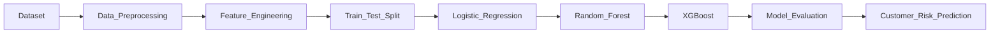

# 🤖 Machine Learning Deliverables

This directory contains all machine learning artifacts developed for the customer churn prediction module of the **Airline Loyalty & Retention Analytics** project.

The objective of the machine learning pipeline is to identify customers at risk of leaving the airline loyalty program and support data-driven retention strategies.

---

## 📂 Directory Structure

```
ML Implementation/
│
├── Deliveral Data/
│   └── (Processed dataset used for model training)
│
├── logistic_regression_model.joblib
├── random_forest.pkl
├── xgboost.pkl
├── models.ipynb
└── README.md
```

---

## 📊 Machine Learning Pipeline



---

## 🧹 Data Preparation

The dataset used for model development was created after extensive preprocessing and feature engineering performed during the analytics phase.

Preprocessing included:

- Missing value handling
- Feature selection
- Categorical encoding
- Numerical scaling (where applicable)
- Customer-level aggregation

---

## 🤖 Models Implemented

Three supervised learning algorithms were trained and evaluated.

| Model | Purpose |
|--------|----------|
| Logistic Regression | Baseline interpretable classifier |
| Random Forest | Captures non-linear feature relationships |
| XGBoost | Gradient boosting model with the best predictive performance |

---

## 📦 Saved Models

The trained models are provided for future inference and deployment.

| File | Description |
|------|-------------|
| `logistic_regression_model.joblib` | Trained Logistic Regression model |
| `random_forest.pkl` | Trained Random Forest model |
| `xgboost.pkl` | Final XGBoost model |

---

## 📒 Notebook

The `models.ipynb` notebook contains the complete machine learning workflow, including:

- Data loading
- Data preprocessing
- Feature engineering
- Train-test split
- Model training
- Hyperparameter tuning
- Performance evaluation
- Customer risk prediction

---

## 📈 Model Evaluation

Models were evaluated using standard classification metrics, including:

- Accuracy
- Precision
- Recall
- F1 Score
- Confusion Matrix
- ROC-AUC Score

The comparative evaluation enabled selection of the most suitable model for customer risk scoring.

---

## 🎯 Prediction Objective

The trained models classify customers based on their likelihood of churn, enabling proactive identification of high-risk customers and supporting targeted retention strategies.

---

## 🚀 Future Improvements

- Hyperparameter optimization
- Explainable AI using SHAP
- Cross-validation for improved model robustness
- Model deployment as a REST API
- Real-time customer risk prediction
- Automated model retraining pipeline
- Integration of an LLM-powered explanation system to generate human-readable insights and personalized retention recommendations for each customer risk prediction
