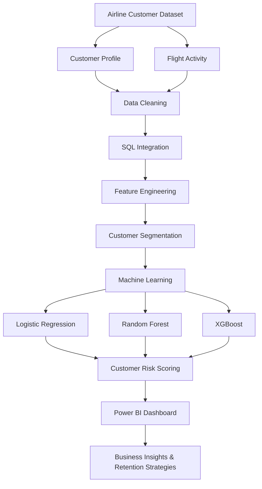
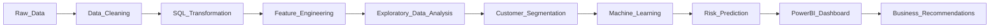
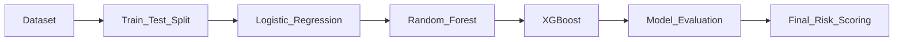

# ✈️ Optimizing Airline Loyalty & Retention Using Customer Analytics and Machine Learning

<p align="center">


</p>

---

## 📌 Project Overview

Airline loyalty programs generate massive amounts of customer data, yet identifying customers likely to disengage remains a major challenge.

This project presents an **end-to-end customer analytics and machine learning solution** that combines **SQL-based data processing, feature engineering, predictive modeling, and interactive Power BI dashboards** to help airlines proactively identify at-risk customers and design personalized retention strategies.

The project demonstrates how analytics and machine learning can transform raw operational data into actionable business insights.

---

# 🎯 Business Objectives

- Understand customer behavior across the loyalty program
- Segment customers based on value and engagement
- Predict customer churn using machine learning
- Estimate revenue at risk
- Generate actionable retention recommendations
- Build an interactive executive dashboard for decision-makers

---

# 🚀 Key Highlights

- ✅ End-to-End Analytics Pipeline
- ✅ SQL-Based Data Processing
- ✅ Feature Engineering
- ✅ Customer Segmentation
- ✅ Churn Prediction
- ✅ Customer Risk Scoring
- ✅ Interactive Power BI Dashboard
- ✅ Business Recommendation System

---

# 🏗️ Project Architecture



---

# 🔄 End-to-End Workflow



---

# 📂 Repository Structure

```
airline-loyalty-retention-analytics
│
├── dashboard/
│   ├── Airline_Dashboard.pbix
│   ├── dashboard_preview.png
│   └── screenshots/
│
├── images/
│
├── ml/
│   ├── notebooks/
│   ├── trained_models/
│   └── processed_data/
│
├── sql/
│
├── reports/
│
├── README.md
├── requirements.txt
└── LICENSE
```

---

# 📊 Dataset

The project utilizes airline loyalty program data consisting of:

- Customer Demographics
- Loyalty Card Information
- Customer Lifetime Value (CLV)
- Flight Activity History
- Monthly Flight Records
- Reward Points
- Enrollment & Cancellation Information

---

# 🛠 Technology Stack

| Category | Technologies |
|-----------|--------------|
| Programming | Python |
| Data Processing | Pandas, NumPy |
| Machine Learning | Scikit-Learn, XGBoost |
| Visualization | Power BI, Matplotlib |
| Database | SQL |
| Development | Jupyter Notebook |

---

# 🧹 Data Preparation

The dataset was cleaned and standardized through:

- Missing value handling
- Data validation
- Data type corrections
- Customer profile integration
- Flight activity aggregation
- Feature normalization

---

# ⚙️ Feature Engineering

Business-driven features created include:

- Total Flights
- Total Distance Travelled
- Points Balance
- Redemption Rate
- Customer Lifetime Value (CLV)
- Activity Segment
- CLV Segment
- Customer Segment
- Customer Risk Indicators

---

# 👥 Customer Segmentation

Customers were categorized into business-oriented groups such as:

- High Value Active
- High Value At Risk
- Medium Value Regular
- Medium Value Casual
- Low Value Customers

This segmentation enabled targeted retention strategies for different customer profiles.

---

# 🤖 Machine Learning Pipeline

Three supervised learning models were developed and compared.

| Model | Purpose |
|--------|----------|
| Logistic Regression | Baseline Model |
| Random Forest | Capture Non-Linear Relationships |
| XGBoost | Final High-Performance Model |

### Pipeline



Saved trained models are included for future inference and deployment.

---

# 📈 Dashboard

The Power BI dashboard provides an executive overview of:

- Customer Segmentation
- Customer Lifetime Value
- Loyalty Program Performance
- Reward Redemption
- Flight Activity
- Churn Risk Analysis
- Revenue at Risk

> **Dashboard Preview**

<p align="center">


</p>

---

# 📊 Project Results

| Metric | Result |
|----------|---------|
| Customer Segments | 12 |
| High-Risk Customers | 165 |
| Revenue at Risk | ~$776K |
| Loyalty Points Accumulated | 48M+ |
| Predictive Models | 3 |
| Interactive Dashboard | ✅ |

---

# 💼 Business Recommendations

### Protect High-Value Customers

- Personalized offers
- Bonus mile campaigns
- Dedicated customer outreach

---

### Increase Reward Redemption

- Reminder campaigns
- Simplified redemption
- Promotional rewards

---

### Early Churn Detection

- Automated inactivity alerts
- Personalized flight incentives
- Retention campaigns

---

# 🔮 Future Improvements

- Real-time churn prediction
- Streamlit deployment
- Automated ETL pipeline
- Explainable AI using SHAP
- Cloud deployment
- Customer recommendation engine

---

# ⚙️ Installation

Clone the repository

```bash
git clone https://github.com/<username>/airline-loyalty-retention-analytics.git
```

Install dependencies

```bash
pip install -r requirements.txt
```

---

# 👥 Team

| Name | Role |
|-------|------|
| **Arpit Kumar** | Data Engineering & Analytics |
| **Lakshay Bansal** | Business Intelligence & Visualization |
| **Shikhar Shukla** | Machine Learning Engineer |

---

# 📜 License

This project is licensed under the MIT License.

---

# ⭐ Acknowledgements

This project was developed as part of **Summer Projects 2026** organized by the **Consulting & Analytics Club, IIT Guwahati**.

---

## ⭐ If you found this project useful, consider giving the repository a star!
