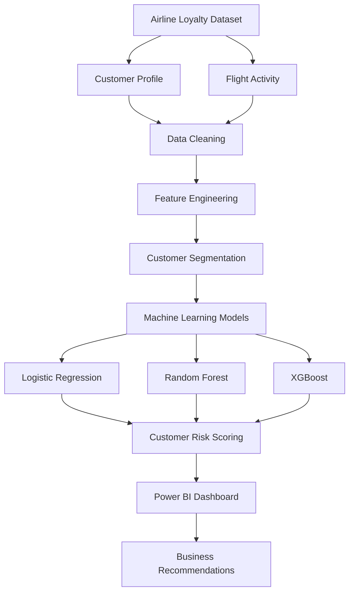
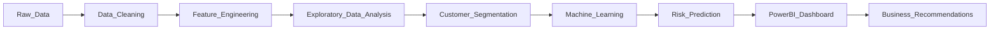
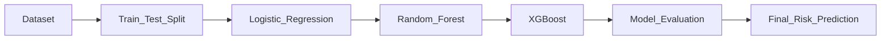

# ✈️ Optimizing Airline Loyalty & Retention Using Customer Analytics and Machine Learning

---

## 📌 Project Overview

Airline loyalty programs generate large volumes of customer and flight activity data. However, identifying customers who are likely to disengage from the loyalty program before they leave remains a significant challenge.

This project presents an **end-to-end customer analytics and machine learning solution** that combines **data preprocessing, feature engineering, predictive modeling, and business intelligence** to identify at-risk customers, estimate revenue impact, and recommend targeted retention strategies.

The solution integrates customer analytics with interactive Power BI dashboards to provide actionable insights for business decision-makers.

---

# 🎯 Business Objectives

- Analyze customer behavior across the airline loyalty program.
- Segment customers based on engagement and lifetime value.
- Predict customer churn using machine learning.
- Estimate potential revenue at risk.
- Generate personalized retention recommendations.
- Build an interactive executive dashboard for business users.

---

# 🚀 Key Highlights

- ✅ End-to-End Customer Analytics Pipeline
- ✅ Data Cleaning & Feature Engineering
- ✅ Customer Segmentation
- ✅ Churn Prediction using Machine Learning
- ✅ Customer Risk Scoring
- ✅ Power BI Executive Dashboard
- ✅ Business Intelligence & Insights

---

# 🏗️ Project Architecture

---

# 🔄 Project Workflow

---

# 📊 Dataset

The project combines customer profile information with monthly airline activity to build a customer-level analytical dataset.

### Customer Information

- Demographics
- Loyalty Card Information
- Customer Lifetime Value (CLV)
- Enrollment Details
- Cancellation Information

### Flight Activity

- Monthly Flight Records
- Total Flights
- Distance Travelled
- Loyalty Points Earned
- Loyalty Points Redeemed

---

# 🛠 Technology Stack

| Category | Technologies |
|-----------|--------------|
| Programming Language | Python |
| Data Processing | Pandas, NumPy |
| Machine Learning | Scikit-Learn, XGBoost |
| Data Visualization | Power BI, Matplotlib |
| Database | SQL |
| Development Environment | Jupyter Notebook |

---

# 🧹 Data Preparation

The raw airline dataset underwent multiple preprocessing steps before analysis:

- Missing value handling
- Data validation
- Data standardization
- Customer profile integration
- Flight activity aggregation
- Data quality verification

These preprocessing steps ensured consistency and improved model performance.

---

# ⚙️ Feature Engineering

Several business-oriented features were engineered to improve customer analytics and predictive performance.

### Customer Metrics

- Total Flights
- Total Distance Travelled
- Points Balance
- Redemption Rate

### Segmentation Features

- Customer Lifetime Value (CLV) Segment
- Activity Segment
- Customer Segment

### Risk Indicators

- Salary Missing Flag
- Cancellation Flag
- Churn Indicators

---

# 👥 Customer Segmentation

Customers were grouped using behavioral and value-based metrics to better understand engagement across the loyalty program.

Major customer groups include:

- High Value Active
- High Value At Risk
- Medium Value Regular
- Medium Value Casual
- Low Value Customers

These segments support targeted marketing campaigns and personalized retention strategies.

---

# 🤖 Machine Learning

Three supervised machine learning models were trained and evaluated for customer churn prediction.

| Model | Purpose |
|--------|----------|
| Logistic Regression | Baseline interpretable model |
| Random Forest | Capture non-linear relationships |
| XGBoost | Final high-performance model |

### Machine Learning Pipeline

The trained models classify customers into different churn-risk categories, enabling proactive intervention before customer disengagement.

---

# 📈 Power BI Dashboard

An interactive executive dashboard was developed to monitor customer engagement, loyalty performance, churn risk, and business KPIs.

The dashboard provides insights into:

- Customer Segmentation
- Customer Lifetime Value
- Monthly Flight Trends
- Loyalty Program Performance
- Reward Redemption
- Churn Analysis
- Revenue at Risk

> *(Dashboard preview will be added soon.)*

---

# 📊 Project Results

| Metric | Result |
|----------|---------|
| Customer Segments | 12 |
| High-Risk Customers Identified | 165 |
| Estimated Revenue at Risk | ~$776K |
| Loyalty Points Accumulated | 48M+ |
| Machine Learning Models | 3 |
| Interactive Dashboard | ✅ |

---

# 💼 Business Recommendations

### Protect High-Value Customers

- Personalized retention campaigns
- Bonus mile offers
- Dedicated customer outreach

### Increase Reward Redemption

- Limited-time reward promotions
- Redemption reminders
- Simplified redemption process

### Early Customer Intervention

- Detect prolonged inactivity
- Trigger personalized campaigns
- Encourage customer re-engagement

---

# 🔮 Future Scope

- Real-time churn prediction
- Automated customer risk monitoring
- Explainable AI for model interpretation
- Customer recommendation system
- Cloud deployment
- Interactive web application

---

# 📚 Project Report

A detailed report describing the methodology, analytics pipeline, feature engineering, machine learning implementation, business insights, and recommendations is included in this repository.

---

## ⭐ If you found this project interesting, consider giving it a star!
